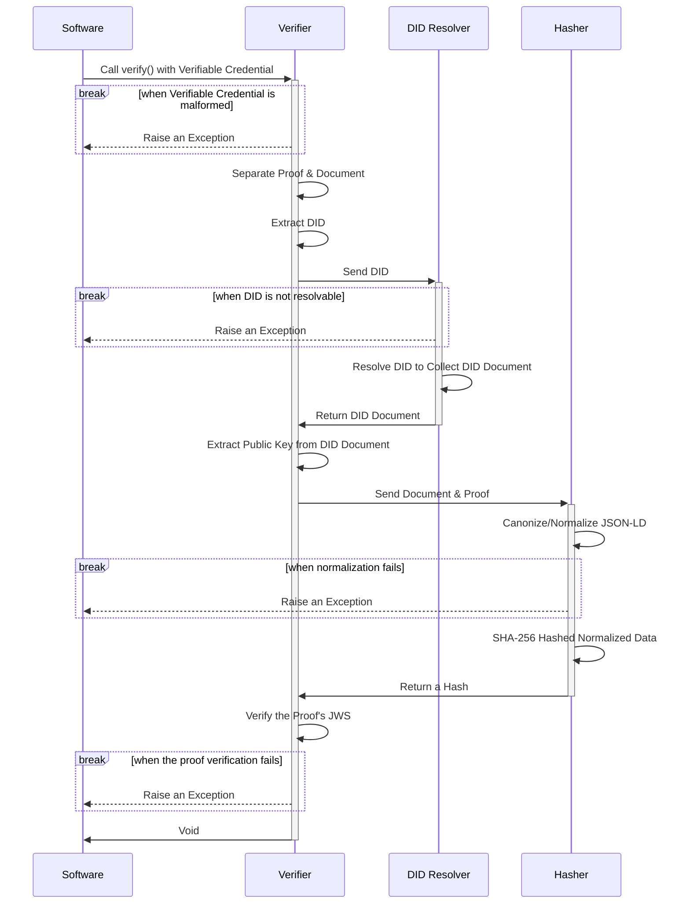

# Gaia-X JSON Web Signature 2020


> 🪶 A lightweight JsonWebSignature2020 signing and verification Typescript library by Gaia-X AISBL

## Requirements

This library is designed to be compatible with Node version 18+.

The main requirements to run this library are to have a Typescript enabled project and an execution environment 
connected to the Internet to be able to resolve DIDs.

## Getting Started

All you need to do is install this package.

```bash
npm install @gaia-x/json-web-signature-2020
```

You can then check out our examples below to get started [signing](#create-a-verifiable-credential) and 
[verifying](#verify-a-verifiable-credential) verifiable credentials.

## Currently Supported

### DID Types

This library is mainly orientated towards Gaia-X verifiable credentials which are only based on `did:web` at the moment 
so other DID types are not supported.

| DID Type | Supported |
|----------|:---------:|
| did:web  |     ✅     |
| did:key  |     ❌     |
| did:ethr |     ❌     |
| did:jwk  |     ❌     |
| did:btcr |     ❌     |
| did:dns  |     ❌     |
| did:ebsi |     ❌     |
| ...      |     ❌     |

> ℹ️ Please note that other DID resolvers can easily be integrated in this project as it is based on [did-resolver](https://github.com/decentralized-identity/did-resolver)
> which offers a plug-and-play driver approach.

### Key Algorithms

This library supports all the algorithms supported by [jose](https://github.com/panva/jose?tab=readme-ov-file) as it is 
used to import public & private keys. Please refer to [jose's implemented specifications chapter](https://github.com/panva/jose?tab=readme-ov-file#implemented-specifications)
to have more details.

| Algorithm | Supported |
|-----------|:---------:|
| HS256     |     ✅     |  
| HS384     |     ✅     |  
| HS512     |     ✅     |  
| PS256     |     ✅     |  
| PS384     |     ✅     |  
| PS512     |     ✅     |  
| RS256     |     ✅     |  
| RS384     |     ✅     |  
| RS512     |     ✅     |  
| ES256     |     ✅     |  
| ES256K    |     ✅     |
| ES384     |     ✅     |  
| ES512     |     ✅     |  
| EdDSA     |     ✅     |  

### Public Key Formats

Public keys are used for verifying verifiable credential proofs and are resolved via the verification method DID, the 
following public key formats are supported when collected from a DID document.

| Format    | Supported |
|-----------|:---------:|
| JWK       |     ✅     |
| Multibase |     ❌     |

## Create a Verifiable Credential

A verifiable credential is created by signing a document with a private key, this process creates a `proof` attribute 
for the verifiable credential with a `jws` attribute containing the signature. This avoids tampering with the verifiable 
credential after it has been signed.

### JSON Web Signature 2020

To sign a document (hence making it a verifiable credential) with the JSON Web Signature 2020 specification, the 
`JsonWebSignature2020Signer` can be used in the following manner.

```typescript
const document: Omit<VerifiableCredential, 'proof'> = { ... }
const signer: Signer = new JsonWebSignature2020Signer({
  privateKey: await jose.importPKCS8(privateKeyPem, privateKeyAlgorithm),
  privateKeyAlgorithm: 'ES256',
  verificationMethod: 'did:web:my-domain.com#key-1'
})

const verifiableCredential: VerifiableCredential = await signer.sign(document)
```

> 👇 Please see the below [Verification Methode](#verification-method) chapter for more details about the 
> `verificationMethod` argument.

### Gaia-X JSON Web Signature 2020

The same method can be used with the `GaiaXSignatureSigner`

```typescript
const document: Omit<VerifiableCredential, 'proof'> = { ... }
const signer: Signer = new GaiaXSignatureSigner({
  privateKey: await jose.importPKCS8(privateKeyPem, privateKeyAlgorithm),
  privateKeyAlgorithm: 'ES256',
  verificationMethod: 'did:web:my-domain.com#key-1'
})

const verifiableCredential: VerifiableCredential = await signer.sign(document)
```

> 👇 Please see the below [Verification Methode](#verification-method) chapter for more details about the
> `verificationMethod` argument.

### Verification Method

The `verificationMethod` argument in the above examples corresponds to the verifiable credential's 
`proof.verificationMethod` attribute. This attribute is built by concatenating the DID and the public key ID with a
`#` separating them.

## Verify a Verifiable Credential

### Verifiers

All verifiable credential verification is done through what we call a `Verifier`, it is in charge of coordinating all 
the steps and components necessary to that verification.

<details>
<summary>Verifier Sequence Diagram</summary>



> 👀 Don't hesitate to check out the `*.spec.ts` test files to find some real life examples of the usage of verifiers.

</details>

### JSON Web Signature 2020

To verify a JSON Web Signature 2020 signed verifiable credential, you will need to instantiate the `JsonWebSignature2020Verifier`
class which packs all the necessary logic to validate it using the proof attribute.

```typescript
const verifier: Verifier = new JsonWebSignature2020Verifier()

try {
  await verifier.verify(verifiableCredential)
} catch (e) {
  // Manage the verification exception
}
```

### Gaia-X JSON Web Signature 2020

Just like the previous chapter, Gaia-x JSON Web Signature 2020 can be verified with the `GaiaXSignatureVerifier` class.

```typescript
const verifier: Verifier = new GaiaXSignatureVerifier()

try {
  await verifier.verify(verifiableCredential)
} catch (e) {
  // Manage the verification exception
}
```

## Overriding with Options

Developers using this library will have different goals and needs depending on their application. To fit those needs,
options have been introduced to be able to tweak the library's behaviour.

### Using Options

Each component of this library can be tweaked with its own `Options` object :
- `Hasher` uses the base `Options` class
- `Signer` uses the `SignerOptions` class which extends `Options`
- `Verifier` uses the `VerifierOptions` class which extends `Options`

```typescript
// Hasher
const hasherOptions: Options = {
  documentLoader: myDocumentLoader,
  safe: false
}
const hasher: Hasher = new JsonWebSignature2020Hasher(hasherOptions)

// Signer
const signerOptions: Options = {
  privateKey: myPrivateKey,
  privateKeyAlg: myPrivateKeyAlg,
  verificationMethod: myVerificationMethod,
  documentLoader: myDocumentLoader,
  safe: false
}
const signer: Signer = new JsonWebSignature2020Signer(signerOptions)

// Verifier
const verifierOptions: Options = {
  didResolver: myDidResolver,
  documentLoader: myDocumentLoader,
  safe: false
}
const verifier: Verifier = new JsonWebSignature2020Verifier(verifierOptions)
```

> ☝️ Don't hesitate to check out the option classes in the [src/options/](./src/options) folder to find out which attributes
> are available. Modern IDEs integrate attribute resolution and autocompletion which can help you navigate possibilities.

### Custom DidResolver

If a developer needs to use other DID methods or a custom DID resolver, this can be done through the `Verifier`'s 
constructor.

```typescript
const didResolver: CustomDidResolver = new CustomDidResolver()
const verifier: Verifier = new JsonWebSignature2020Verifier({ didResolver })
```

### Offline Contexts

In certain cases, like verifying many verifiable credentials per second, rate-limiting can cause issues with JSON-LD 
context resolving. An `OfflineDocumentLoaderBuilder` has been provided in this library to locally resolve given contexts, it 
can easily be used by injecting it in the wanted `Hasher` or `Verifier`.

Custom contexts can be added to this document loader by calling the `OfflineDocumentLoaderBuilder#addContext(string, any)`
method with the context's URL and its content which can be imported from a JSON file.

#### For Verifiers

```typescript
const offlineDocumentLoader: DocumentLoader = new OfflineDocumentLoaderBuilder().build()
const verifier: Verifier = new JsonWebSignature2020Verifier({ documentLoader: offlineDocumentLoader })
```

#### For Hashers

```typescript
const offlineDocumentLoader: DocumentLoader = new OfflineDocumentLoaderBuilder().build()
const hasher: Verifier = new JsonWebSignature2020Hasher({ documentLoader: offlineDocumentLoader })
```

#### With Custom Contexts

```typescript
import MyContext from 'contexts/my-context.json'
import CustomContext from 'contexts/custom-context.json'

const offlineDocumentLoader: DocumentLoader = new OfflineDocumentLoaderBuilder()
    .addContext('https://my-context.org/2024/entities/v1', MyContext)
    .addContext('https://custom-context.org/2024/entities/v1', CustomContext)
    .build()
```

> 🔍 Make sure you have `"resolveJsonModule": true` is your `tsconfig.json` configuration file in order to be able to import
> the contexts from JSON files.

## Utilities

As this library needs to work on multiple aspects of verifiable credentials and JSON-LD in general, some utility classes
are made available for developers.

### Context Handler

The `ContextHandler` class allows developers to manipulate JSON-LD contexts with ease, please see 
[the class' JSDoc](src/jsonld/context.handler.ts) for more details.

```typescript
import { ArrayContext } from './jsonld.types'

const context: ArrayContext = ContextHandler.fromContext(context)
  .add('https://www.w3.org/ns/odrl.jsonld')
  .add('https://w3id.org/security/suites/jws-2020/v1')
  .toContext()

verifiableCredential['@context'] = context
```

> ⚠️ Aliased contexts are not managed at the moment as JSON-LD expansion/compaction issues arise. Only contexts in the
> form of arrays are supported.